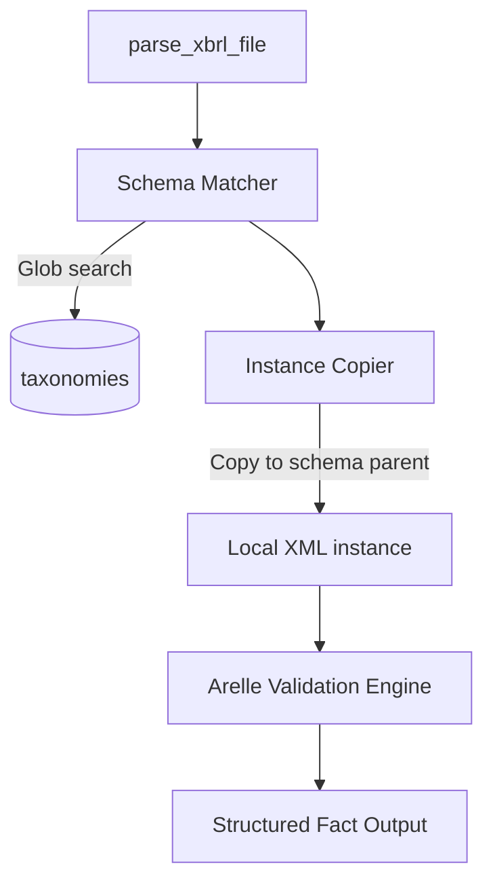

# Architecture

The `nse-xbrl-parser` library enforces a strict separation between the API entry-point, the dynamic XML rewrite phase, and the heavyweight Arelle validation engine.

## Module Structure

## Data Flow
1. **Input**: A raw XML path is provided to `parse_xbrl_file()`.
2. **Schema Matching**: The parser uses simple regex to locate the target `href` inside the XML's `<link:schemaRef>` tag. It globs the local `taxonomies` directory to find the specific historical XSD subdirectory.
3. **Locality Injection**: To preserve read-only constraints, the parser copies the input XBRL XML into the SAME directory as the discovered schema (as a `_temp_` file). This allows Arelle to resolve `..` relative paths natively.
4. **Validation**: The `arelle` engine is booted up silently to load this local temporary XML, ensuring all imports are found offline.
5. **Fact Extraction**: QName keys are resolved against the taxonomy into human-readable labels.
6. **Cleanup**: The temporary `_temp_` XML is immediately unlinked.

## Principles
* **Read-Only**: The module's root directory (`site-packages`) is never written to.
* **Silent**: Arelle generates no stdout/stderr logging noise, preserving AI agent context windows.
* **Typing**: Strict `typing` module compliance on endpoints.
