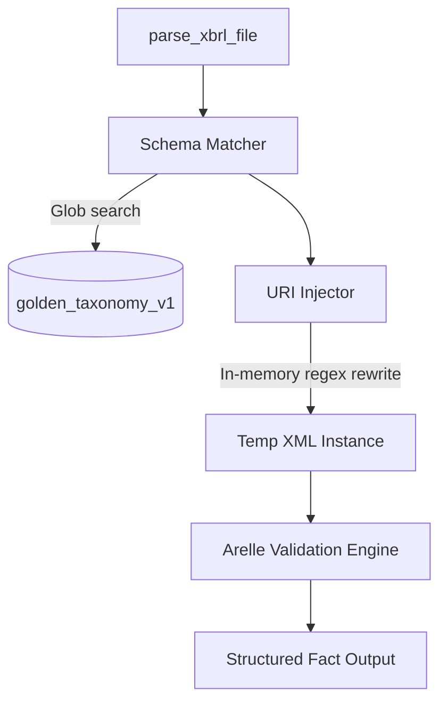

# Architecture

The `nse-xbrl-parser` library enforces a strict separation between the API entry-point, the dynamic XML rewrite phase, and the heavyweight Arelle validation engine.

## Module Structure

## Data Flow
1. **Input**: A raw XML path is provided to `parse_xbrl_file()`.
2. **Schema Matching**: The parser uses simple regex to locate the target `href` inside the XML's `<link:schemaRef>` tag. It globs the local `golden_taxonomy_v1` directory to find the exact historical XSD.
3. **In-Memory Injection**: To preserve read-only constraints (docker/pip installs), the parser modifies the XML string in-memory, replacing the relative `href` with an absolute `file://` URI pointing to the bundled taxonomy.
4. **Temporary Isolation**: The customized XML is written to an ephemeral, isolated temporary directory.
5. **Validation**: The `arelle` engine is booted up silently (with `logToBuffer`) to load the temporary XML and validate it against the explicitly linked offline schema.
6. **Fact Extraction**: QName keys are resolved against the taxonomy to human-readable labels (preferring `en` standard labels, falling back to `verboseLabel`).

## Principles
* **Read-Only**: The module's root directory (`site-packages`) is never written to.
* **Silent**: Arelle generates no stdout/stderr logging noise, preserving AI agent context windows.
* **Typing**: Strict `typing` module compliance on endpoints.
