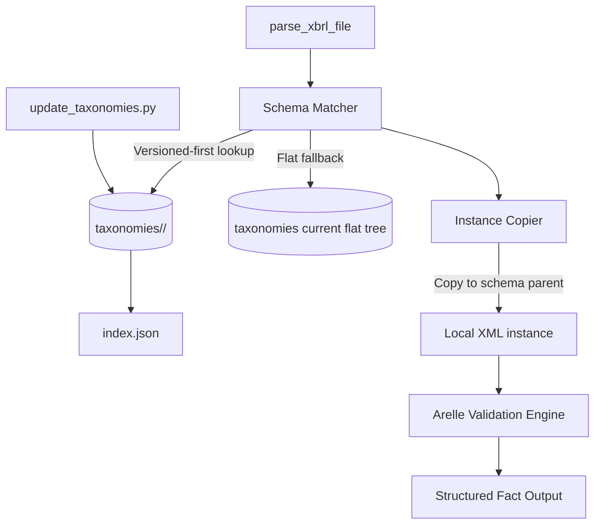

# Architecture

The `nse-xbrl-parser` library enforces a strict separation between the API entry-point, the dynamic XML rewrite phase, and the heavyweight Arelle validation engine.

## Module Structure

```mermaid
graph TD;
    API[parse_xbrl_file] --> Matcher[Schema Matcher]
    Matcher -->|Versioned-first lookup| Versioned[(taxonomies/<family>/<release_id>)]
    Matcher -->|Flat fallback| Flat[(taxonomies current flat tree)]
    Updater[update_taxonomies.py] --> Versioned
    Versioned --> Index[index.json]
    Matcher --> Copier[Instance Copier]
    Copier -->|Copy to schema parent| Temp[Local XML instance]
    Temp --> Arelle[Arelle Validation Engine]
    Arelle --> JSON[Structured Fact Output]
```

## Data Flow
1. **Input**: A raw XML path is provided to `parse_xbrl_file()`.
2. **Schema Matching**: The parser locates the target `href` inside the XML's `<link:schemaRef>` tag. It searches versioned family releases first and only falls back to the flat top-level taxonomy tree if no versioned candidate exists.
3. **Versioned Release Store**: `src/nse_xbrl_parser/taxonomy_store.py` fingerprints release units by `family + core + contents` and writes them under `taxonomies/<family>/<release_id>/...`. `index.json` records family, fingerprint, provenance, and stored path.
4. **Updater Path**: `scripts/update_taxonomies.py` downloads fresh NSE ZIPs, extracts each archive in isolation, detects family release units, and appends only self-contained releases whose family+fingerprint pair is not already present.
5. **Compatibility Filter**: Before invoking Arelle, the parser drops candidate entry-points whose local relative imports are missing or disagree with their declared namespaces.
6. **Locality Injection**: The parser copies the input XBRL XML into the SAME directory as the discovered schema (as a `_temp_` file). This allows Arelle to resolve `..` relative paths natively.
7. **Validation and Fact Extraction**: The `arelle` engine loads the temporary XML, resolves labels, and emits unique facts.
8. **Cleanup**: The temporary `_temp_` XML is immediately unlinked.

## Principles
* **Read-Only**: The module's root directory (`site-packages`) is never written to.
* **Silent**: Arelle generates no stdout/stderr logging noise, preserving AI agent context windows.
* **Typing**: Strict `typing` module compliance on endpoints.
