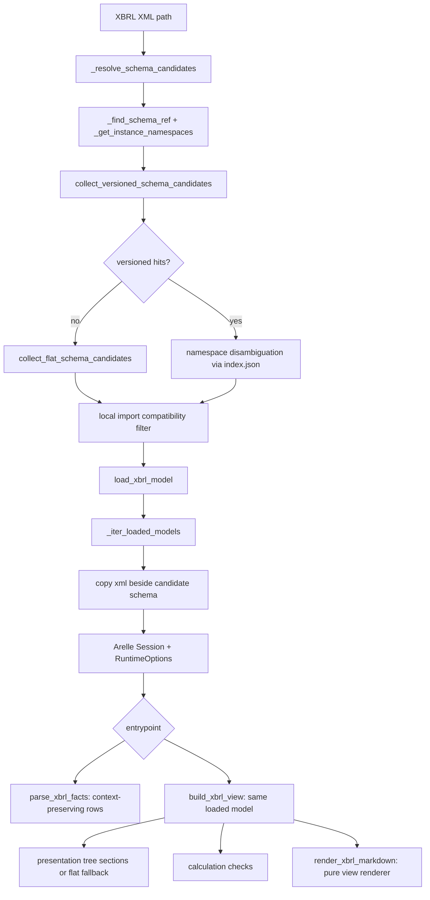

# MAP

## Repository layout

- `src/nse_xbrl_parser/__init__.py`
  - Public API exports: `parse_xbrl_facts`, `build_xbrl_view`, `render_xbrl_markdown`, `load_xbrl_model`, and `__version__`.
- `src/nse_xbrl_parser/parser.py`
  - Core parse pipeline for schema resolution, shared Arelle loading, and context-preserving fact extraction.
- `src/nse_xbrl_parser/view.py`
  - Taxonomy-backed human view builder and markdown renderer.
  - Extracts presentation trees, calculation validations, and safe no-linkbase fallback sections from a single loaded model.
- `src/nse_xbrl_parser/taxonomy_store.py`
  - Taxonomy release/index model and schema candidate discovery helpers.
- `src/nse_xbrl_parser/taxonomies/`
  - Bundled offline taxonomy archive and `index.json` release manifest.
- `scripts/update_taxonomies.py`
  - Updater that appends newly discovered taxonomy releases.
- `tests/test_parser.py`
  - Integration tests for `build_xbrl_view`, markdown rendering, and live NSE XML downloads.
- `tests/test_parse_facts.py`
  - Integration tests for context-preserving `parse_xbrl_facts` output.

## Parser and view flow

## Data responsibilities

- `_resolve_schema_candidates` in `parser.py`
  - Extracts `schemaRef` from instance XML.
  - Prefers versioned release candidates from taxonomy index.
  - Filters ambiguous candidates using instance namespaces and local import checks.
- `load_xbrl_model` in `parser.py`
  - Resolves schema candidates and yields the first Arelle model with facts inside a context manager.
  - Filters ambiguous candidates by entrypoint target namespace before Arelle retries.
  - Keeps the Arelle session open only for the caller's extraction block.
- `_iter_loaded_models` in `parser.py`
  - Runs Arelle for each candidate schema.
  - Rejects models with zero facts.
  - Cleans temporary copied XML files.
- `parse_xbrl_facts` in `parser.py`
  - Produces a tidy fact table with concept/context/unit/period/basis/dimensions.
- `build_xbrl_view` in `view.py`
  - Memoizes built views in-process by file path, mtime, size, and output options.
  - Loads the model once and extracts facts, presentation structure, and calculation checks from that shared model.
  - Emits human-facing `title`, `unit`, `columns`, `sections`, and `checks` by default.
  - Adds DTS plumbing and diagnostics only under `trace` when `include_trace=True`.
  - Falls back to explicit period/basis/dimension grouping when presentation linkbases are unavailable or do not match reported facts.
- `render_xbrl_markdown` in `view.py`
  - Renders a view dictionary into markdown without reading files or mutating input.
- `taxonomy_store.py`
  - Stores releases under `taxonomies/<family>/<release_id>/...`.
  - Maintains `index.json` used for fast candidate lookup.
  - Falls back to non-versioned flat tree when required.
