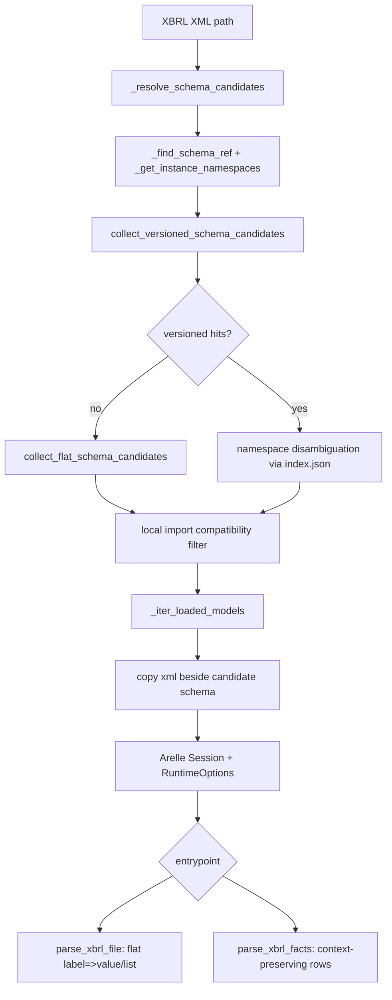

# MAP

## Repository layout

- `src/nse_xbrl_parser/__init__.py`
  - Public API exports: `parse_xbrl_file`, `parse_xbrl_facts`, and `__version__`.
- `src/nse_xbrl_parser/parser.py`
  - Core parse pipeline shared by both parser entry points.
  - Builds Arelle models, resolves schemas, and extracts fact outputs.
- `src/nse_xbrl_parser/taxonomy_store.py`
  - Taxonomy release/index model and schema candidate discovery helpers.
- `src/nse_xbrl_parser/taxonomies/`
  - Bundled offline taxonomy archive and `index.json` release manifest.
- `scripts/update_taxonomies.py`
  - Updater that appends newly discovered taxonomy releases.
- `tests/test_parser.py`
  - Integration tests against live NSE XML downloads.

## Parser flow

## Data responsibilities

- `_resolve_schema_candidates` in `parser.py`
  - Extracts `schemaRef` from instance XML.
  - Prefers versioned release candidates from taxonomy index.
  - Filters ambiguous candidates using instance namespaces and local import checks.
- `_iter_loaded_models` in `parser.py`
  - Runs Arelle for each candidate schema.
  - Rejects models with zero facts.
  - Cleans temporary copied XML files.
- `parse_xbrl_file` in `parser.py`
  - Produces announcement-oriented flat dictionary keyed by human labels.
  - Collapses repeated labels into arrays.
- `parse_xbrl_facts` in `parser.py`
  - Produces a tidy fact table with concept/context/unit/period/basis/dimensions.
- `taxonomy_store.py`
  - Stores releases under `taxonomies/<family>/<release_id>/...`.
  - Maintains `index.json` used for fast candidate lookup.
  - Falls back to non-versioned flat tree when required.
